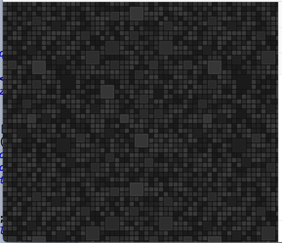

## padolsey



generate padolsey patterns


### usage

```javascript

const padolsey = require('padolsey')


window.addEventListener('click', function() {
  document.body.style.background = `url(${padolsey()})`
})
```
