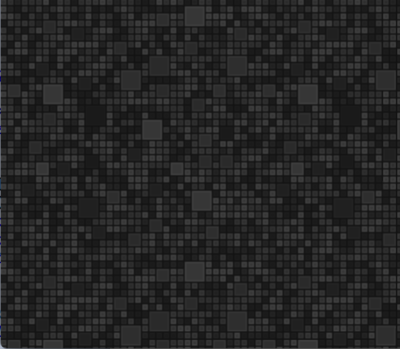

## padolsey

procedurally generate padolsey patterns




### commonjs (node) usage

```javascript
const padolsey = require('padolsey')


window.addEventListener('click', function () {
  document.body.style.background = `url(${padolsey()})`
})
```


### es modules usage

```javascript
import padolsey from 'padolsey'


window.addEventListener('click', function () {
  document.body.style.background = `url(${padolsey()})`
})
```
